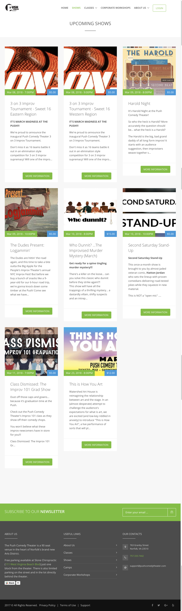
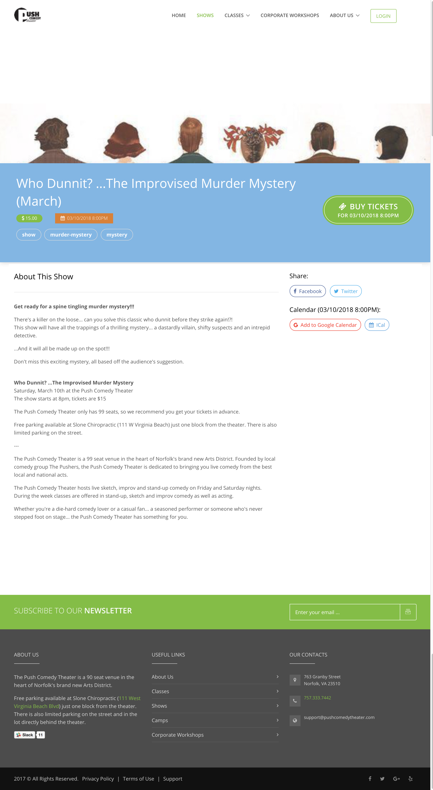
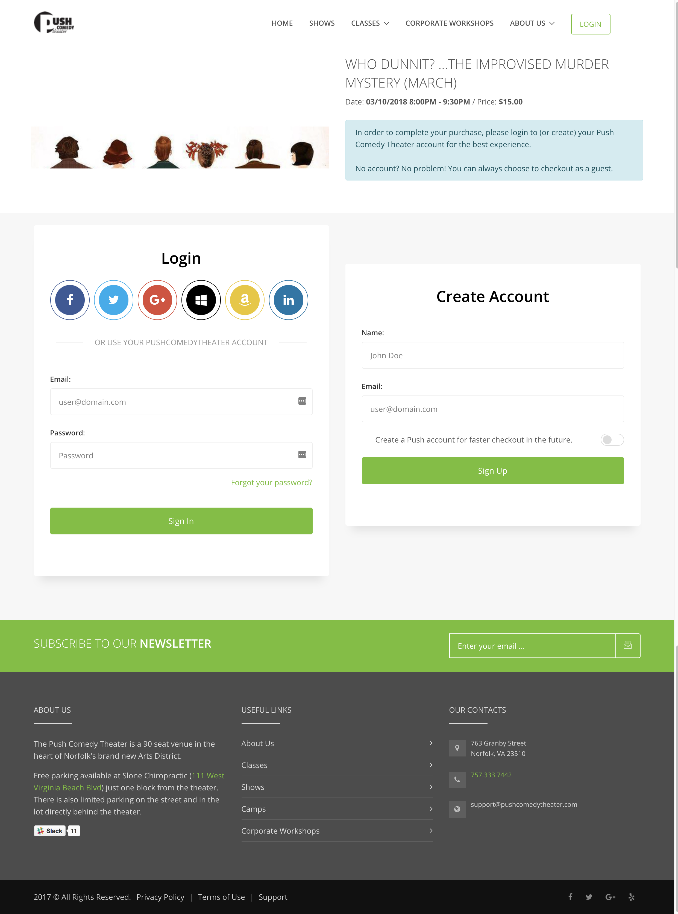
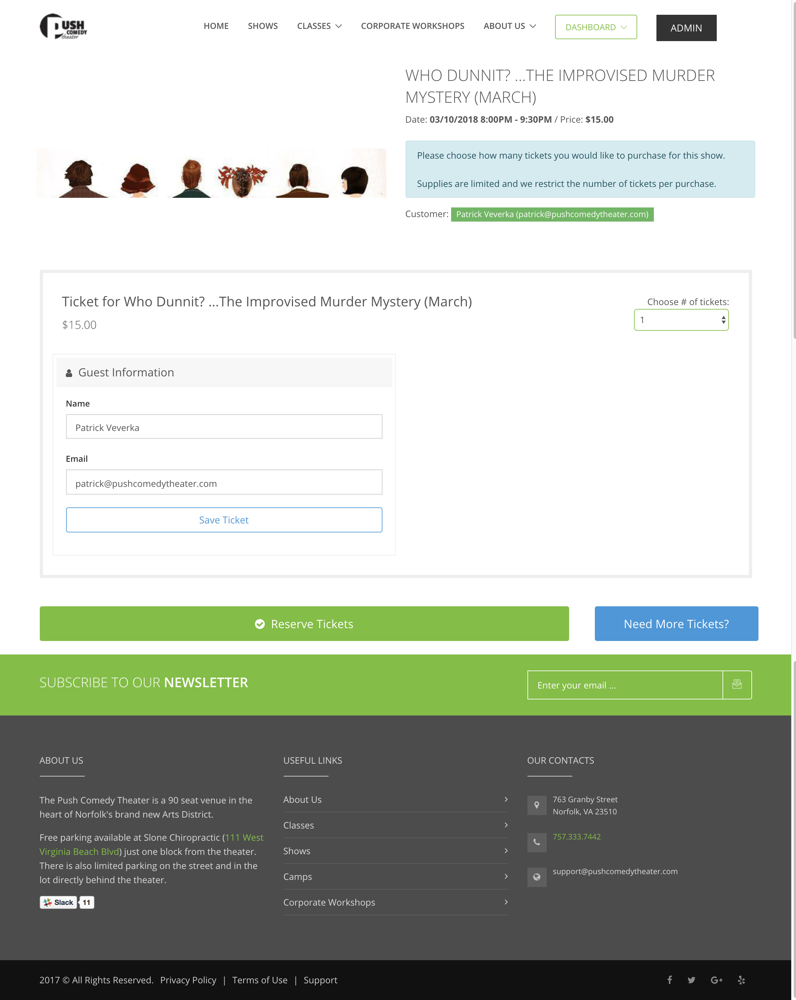
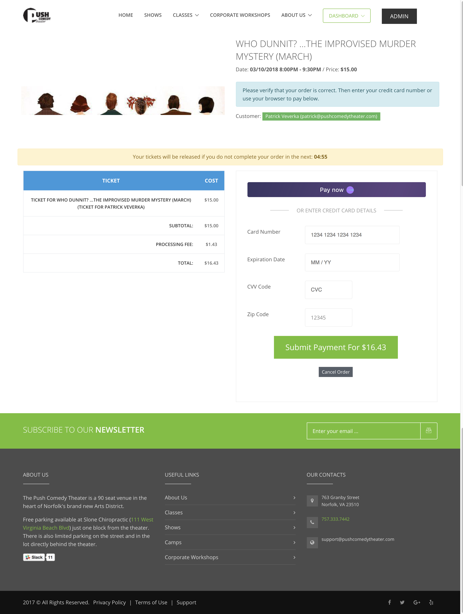
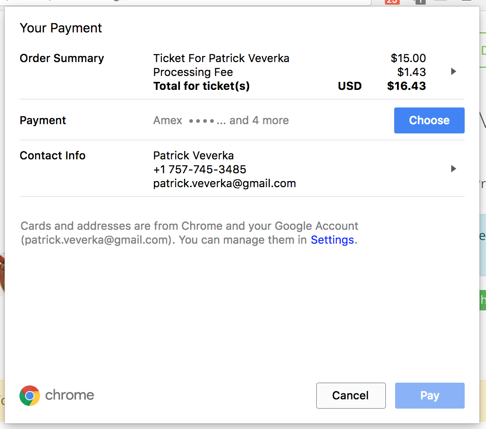
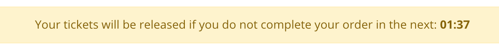

# Show Listing

When a user visits the Shows page, they will see a dynamic listing of upcoming shows.  These will be autorefreshed when new shows are added and listings will auto-expire as they pass.

Clicking through any of these will take the user to a page with more information and a Call To Action button to purchase tickets.  Additionally, the user can add the listing to their calendar and share to Facebook or Twitter.

If they decide that they want to purchase a ticket and click on the green Buy Ticket button, they are taken into the purchase flow.  At this point, much like our previous ticket processing application, the user is given the ability to login or checkout as a guest.  If they login to a PushComedyTheater.com account, they must provide a name, an email address and a password.  They can checkout as a guest by providing their name and email address.  If they have used that email address previously, we send them an email with a one time link in it to login to that email address.

We allow the user to also use their social network accounts so that they don't have to remember any new passwords.  We have login from Twitter, Facebook, Google, Amazon, LinkedIn, and Microsoft.

After logging in, the user must select how many tickets they would like and fill out basic information (name and email) for each ticket.  Unlike our previous solution, we do not send emails to people in this flow.

On the next page, the user is prompted to enter their credit card details.  Alternatively, users may instead use the built-in payment details from their browser by clicking on the Pay Now button. 

If they choose to use the builtin payment button, they will be prompted by their browser.

What is nice about this is that it has built-in Apple Pay and Android Pay if they are on their phones.

We require the user to complete their checkout in 5 minutes.

